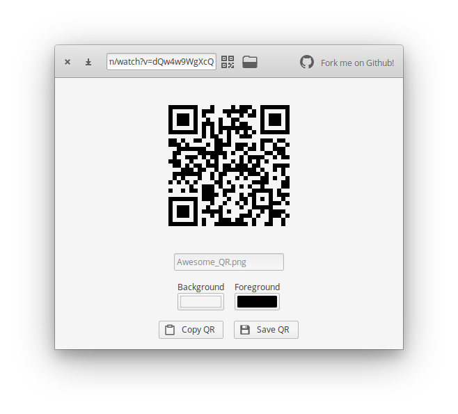
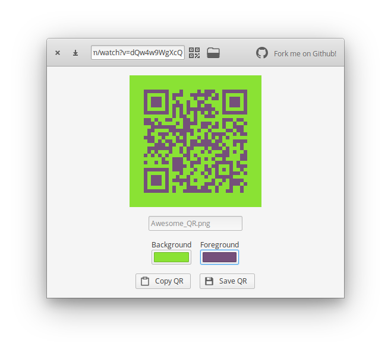
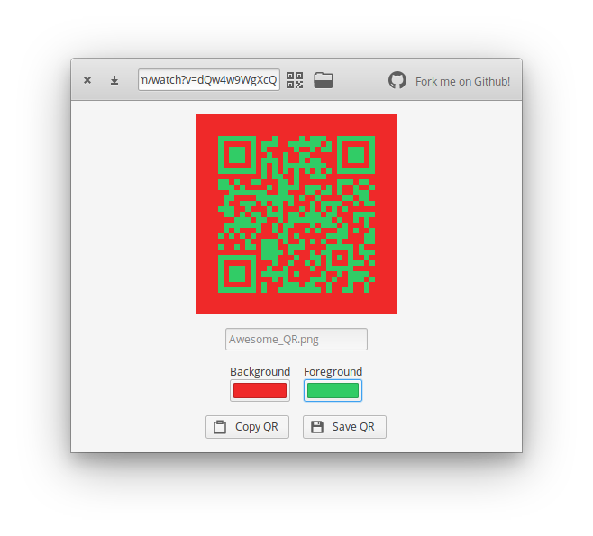

<p align="center">
  
</p>
<h1 align="center">QRit</h1>


----------

| ||
|---------------------|---------------------|
| ||

<p align="center">
  <a href="https://appcenter.elementary.io/com.github.sergius02.qrit"></a>
</p>

With QRit you can create awesome QR codes 🤖️, you can change the background and foreground color to help you integrate them in any place.

This application use the incredible [qrencode](https://github.com/fukuchi/libqrencode)

## Dependencies

Ensure you have these dependencies installed

* valac
* glib-2.0
* gtk+-3.0
* [qrencode](https://fukuchi.org/works/qrencode/)

## Install, build and run

```bash
# install elementary-sdk, meson and ninja
sudo apt install elementary-sdk meson ninja
# install qrencode
sudo apt install qrencode
# clone repository
git clone https://github.com/sergius02/QRit QRit
# cd to dir
cd QRit
# run meson
meson build --prefix=/usr
# cd to build, build and test
cd build
ninja
sudo ninja install
```

Important
>
>For the file QR generation, the limit is approximately 3KB


## Credits

* [qrencode](https://github.com/fukuchi/libqrencode)
* [REMIXICON](https://remixicon.com/)
* [Visual studio code](https://code.visualstudio.com/)

----------

If you like my work you can

<a href="https://www.buymeacoffee.com/sergius02" target="_blank"></a>